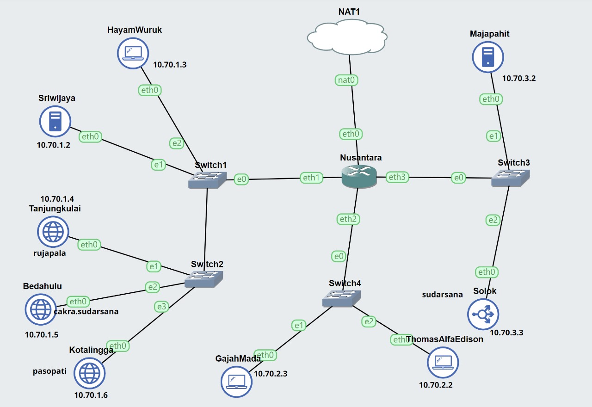

# Jarkom-Modul-2-IT13-2024

## Persiapan

### Script .bashrc Nusantara

```sh
iptables -t nat -A POSTROUTING -o eth0 -j MASQUERADE -s 10.70.0.0/16
echo nameserver 192.168.122.1 > /etc/resolv.conf
cat /etc/resolv.conf
```

### Script .bashrc Sriwijaya dan Majapahit

```sh
echo nameserver 192.168.122.1 > /etc/resolv.conf
apt-get update
apt-get install bind9 -y
```

### Script .bashrc Clients (HayamWuruk, GajahMada, ThomasAlvaEdison)

```sh
echo nameserver 10.70.1.3 >> /etc/resolv.conf
```

### Buat Topologi



## Pengerjaan Soal

## NO. 1

### Konfigurasi

### Nusantara (Router)

```
auto eth0
iface eth0 inet dhcp

auto eth1
iface eth1 inet static
	address 10.70.1.1
	netmask 255.255.255.0

auto eth2
iface eth2 inet static
	address 10.70.2.1
	netmask 255.255.255.0

auto eth3
iface eth3 inet static
	address 10.70.3.1
	netmask 255.255.255.0
```

### HayamWuruk (Client)

```
auto eth0
iface eth0 inet static
	address 10.70.1.2
	netmask 255.255.255.0
	gateway 10.70.1.1
```

### Sriwijaya (DNS Master)

```
auto eth0
iface eth0 inet static
	address 10.70.1.3
	netmask 255.255.255.0
	gateway 10.70.1.1
```

### Tanjungkulai (Web Server)

```
auto eth0
iface eth0 inet static
	address 10.70.1.4
	netmask 255.255.255.0
	gateway 10.70.1.1
```

### Bedahulu (Web Server)

```
auto eth0
iface eth0 inet static
	address 10.70.1.5
	netmask 255.255.255.0
	gateway 10.70.1.1
```

### Kotalingga (Web Server)

```
auto eth0
iface eth0 inet static
	address 10.70.1.6
	netmask 255.255.255.0
	gateway 10.70.1.1
```

### Majapahit (DNS Slave)

```
auto eth0
iface eth0 inet static
	address 10.70.2.2
	netmask 255.255.255.0
	gateway 10.70.2.1
```

### Solok (Load Balance)

```
auto eth0
iface eth0 inet static
	address 10.70.2.3
	netmask 255.255.255.0
	gateway 10.70.2.1
```

### GajahMada (Client)

```
auto eth0
iface eth0 inet static
	address 10.70.3.2
	netmask 255.255.255.0
	gateway 10.70.3.1
```

### ThomasAlfaEdison (Client)

```
auto eth0
iface eth0 inet static
	address 10.70.3.3
	netmask 255.255.255.0
	gateway 10.70.3.1
```

## NO. 2

nusantara.sh

```
echo 'zone "sudarsana.it13.com" {
    type master;
    notify yes;
    file "/etc/bind/jarkom/sudarsana.it13.com";
};' >> /etc/bind/named.conf.local

cp /etc/bind/db.local /etc/bind/jarkom/sudarsana.it13.com

echo '
;
; BIND data file for local loopback interface
;
$TTL    604800
@       IN      SOA     sudarsana.it13.com. root.sudarsana.it13.com. (
                        2023101001      ; Serial
                        604800         ; Refresh
                        86400         ; Retry
                        2419200         ; Expire
                        604800 )       ; Negative Cache TTL
;
@       IN      NS      sudarsana.it13.com.
@       IN      A       10.70.2.3     ; IP Solok
www     IN      CNAME   sudarsana.it13.com.' > /etc/bind/jarkom/sudarsana.it13.com

service bind9 restart
```

## NO. 3

nusantara.sh

```
echo 'zone "pasopati.it13.com" {
    type master;
    notify yes;
    file "/etc/bind/jarkom/pasopati.it13.com";
};' >> /etc/bind/named.conf.local

cp /etc/bind/db.local /etc/bind/jarkom/pasopati.it13.com

echo '
;
; BIND data file for local loopback interface
;
$TTL    604800
@       IN      SOA     pasopati.it13.com. root.pasopati.it13.com. (
                        2023101001      ; Serial
                        604800         ; Refresh
                        86400         ; Retry
                        2419200         ; Expire
                        604800 )       ; Negative Cache TTL
;
@       IN      NS      pasopati.it13.com.
@       IN      A       10.70.1.6     ; IP Kotalingga
www     IN      CNAME   pasopati.it13.com.' > /etc/bind/jarkom/pasopati.it13.com

service bind9 restart
```

## NO. 4

nusantara.sh

```
echo 'zone "rujapala.it13.com" {
    type master;
    notify yes;
    file "/etc/bind/jarkom/rujapala.it13.com";
};' >> /etc/bind/named.conf.local

cp /etc/bind/db.local /etc/bind/jarkom/rujapala.it13.com

echo '
;
; BIND data file for local loopback interface
;
$TTL    604800
@       IN      SOA     rujapala.it13.com. root.rujapala.it13.com. (
                        2023101001      ; Serial
                        604800         ; Refresh
                        86400         ; Retry
                        2419200         ; Expire
                        604800 )       ; Negative Cache TTL
;
@       IN      NS      rujapala.it13.com.
@       IN      A       10.70.1.4     ; IP Tanjungkulai
www     IN      CNAME   rujapala.it13.com.' > /etc/bind/jarkom/rujapala.it13.com

service bind9 restart
```

## NO. 5

Script (Clients - HayamWuruk, GajahMada, dan ThomasAlfaEdison)

```
ping sudarsana.it13.com -c 4
ping www.sudarsana.it13.com -c 4

ping pasopati.it13.com -c 4
ping www.pasopati.it13.com -c 4

ping rujapala.it13.com -c 4
ping www.rujapala.it13.com -c 4
```

### Hasil :

### HayamWuruk


### GajahMada


### ThomasAlfaEdison


## NO.6
1. Tambahkan ke file `/etc/bind/named.conf.local`
2. Memasukkan Pointer Record dari Kota Lingga
   ```
   zone "1.70.10.in-addr.arpa" {
    type master;
    file "/etc/bind/it13/1.70.10.in-addr.arpa";
   };
   ```

4. Membuat DNS Record 
```cp /etc/bind/db.local /etc/bind/it13/1.70.10.in-addr.arpa```
5. Melakukan perubahan pada DNS Record
```
;
; BIND data file for local loopback interface
;
$TTL    604800
@       IN      SOA     pasopati.it13.com. root.pasopati.it13.com. (
                        2023101001      ; Serial
                        604800         ; Refresh
                        86400         ; Retry
                        2419200         ; Expire
                        604800 )       ; Negative Cache TTL
;
1.70.10.in-addr.arpa.   IN  NS          pasopati.it13.com.
6                       IN  PTR         pasopati.it13.com.
``` 
   5. Lakukan restart pada bind9 `service bind9 restart`
   6. Tes pada pointer record


## NO.7 

1. Lakukan perubahan pada Sriwijaya DNS dengan mengedit `/etc/bind/named.conf.local`
2. Lakukan perubahan sebagai berikut
```
zone "sudarsana.it13.com" {
    type master;
    notify yes;
    file "/etc/bind/jarkom/sudarsana.it13.com";
};

zone "pasopati.it13.com" {
    type master;
    notify yes;
    file "/etc/bind/jarkom/pasopati.it13.com";
};

zone "rujapala.it13.com" {
    type master;
    notify yes;
    file "/etc/bind/jarkom/rujapala.it13.com";
};

zone "1.70.10.in-addr.arpa" {
    type master;
    file "/etc/bind/it13/1.70.10.in-addr.arpa";
   };
```
3. Restart bind9 `service bind9 restart`
4. Buat DNS Slave pada Majapahit dengan mengedit pada `/etc/bind/named.conf.local`
```
zone "sudarsana.it13.com" {
    type slave;
    masters { 10.70.1.2; };
    file "/var/lib/bind/sudarsana.it13.com";
};

zone "pasopati.it13.com" {
    type slave;
    masters { 10.70.1.2; };
    file "/var/lib/bind/pasopati.it13.com";
};

zone "rujapala.it13.com" {
    type slave;
    masters { 10.70.1.2; };
    file "/var/lib/bind/rujapala.it13.com";
};
```
5. Restart bind9 `service bind9 restart`

Test 
# Ketika Sriwijaya Mati 

# Tetap Dapat Melakukan Ping 


## NO. 8 
1. Melakukan perubahan pada DNS Rec dengan menambahkan subdomain cakra pada Bedahulu
```
;
; BIND data file for local loopback interface
;
$TTL    604800
@       IN      SOA     sudarsana.it13.com. root.sudarsana.it13.com. (
                        2023101001      ; Serial
                        604800         ; Refresh
                        86400         ; Retry
                        2419200         ; Expire
                        604800 )       ; Negative Cache TTL
;
@       IN      NS      sudarsana.it13.com.
@       IN      A       10.70.2.3    
www     IN      CNAME   sudarsana.it13.com.
cakra   IN      A       10.70.1.5
```
2. Lakukan Restart bind9 `service bind9 restart`

## NO. 9 
Sriwijaya = DNS Master
1. Melakukan perubahan pada `/etc/bind/it13/pasopati.it13.com`
2. Memberikan kewenangan pada DNS Slave yaitu Majapahit `10.70.3.2`
```
;
; BIND data file for local loopback interface
;
$TTL    604800
@       IN      SOA     pasopati.it13.com. root.pasopati.it13.com. (
                              2         ; Serial
                         604800         ; Refresh
                          86400         ; Retry
                        2419200         ; Expire
                         604800 )       ; Negative Cache TTL
;
@       IN      NS      pasopati.it13.com.
@       IN      A       10.70.1.6
@       IN      AAAA    ::1
www     IN      CNAME   pasopati.it13.com.
ns1     IN      A       10.70.3.2
panah   IN      NS      ns1
```
3. Melakukan perubahan pada `/etc/bind/named.conf.options`
```
options {
    directory "/var/cache/bind";
    //dnssec-validation auto;
    allow-query{any;};

    auth-nxdomain no;    # conform to RFC1035
    listen-on-v6 { any; };
```
4. Lakukan restart bind9 `service bind9 restart`
# Bagian 2 
Majapahit = DNS Slave 
1. Lakukan Perubahan pada `/etc/bind/named.conf.local`
```
zone "sudarsana.it13.com" {
    type slave;
    masters { 10.70.1.2; };
    file "/var/lib/bind/sudarsana.it13.com";
};

zone "pasopati.it13.com" {
    type slave;
    masters { 10.70.1.2; };
    file "/var/lib/bind/pasopati.it13.com";
};

zone "rujapala.it13.com" {
    type slave;
    masters { 10.70.1.2; };
    file "/var/lib/bind/rujapala.it13.com";
};

zone "panah.pasopati.it13.com" {
    type master;
    file "/etc/bind/panah/panah.pasopati.it13.com";
};
```
2. Buatlah sebuah direktori dengan path sebagai berikut `/etc/bind/panah`
3. Lakukan perubahan pada `panah.pasopati.it13.com` yang mengarah pada kotalingga `10.70.1.6`
```
;
; BIND data file for local loopback interface
;
$TTL    604800
@       IN      SOA     panah.pasopati.it13.com. root.panah.pasopati.it13.com. (
                              2         ; Serial
                         604800         ; Refresh
                          86400         ; Retry
                        2419200         ; Expire
                         604800 )       ; Negative Cache TTL
;
@       IN      NS      panah.pasopati.it13.com.
@       IN      A       10.70.1.6
@       IN      AAAA    ::1
www     IN      CNAME   panah.pasopati.it13.com.
```
4. Lakukan restart pada bind9 `service bind9 restart`

## NO. 10
Majapahit = DNS Slave 
1. Lakukan Perubahan pada `/etc/bind/panah/panah.pasopati.it13.com`
2. Pada bagian kali ini kita harus menambahkan subdomain log dan CNAME yang baru. Namun ada yang membedakan yaitu diperlukannya `www.log` bukan hanya `www` pada umumnya
```
;
; BIND data file for local loopback interface
;
$TTL    604800
@       IN      SOA     panah.pasopati.it13.com. root.panah.pasopati.it13.com. (
                              2         ; Serial
                         604800         ; Refresh
                          86400         ; Retry
                        2419200         ; Expire
                         604800 )       ; Negative Cache TTL
;
@       IN      NS      panah.pasopati.it13.com.
@       IN      A       10.70.1.6
@       IN      AAAA    ::1
www     IN      CNAME   panah.pasopati.it13.com.
log     IN      A       10.70.1.6
www.log IN      CNAME   panah.pasopati.it13.com.
```
3. Lakukan restart bind9 `service bind9 restart`

## NO. 11
Majapahit = DNS Slave 
1. Lakukan perubahan pada `/etc/bind/named.conf.options` yaitu dengan menambahkan dns forwarder
```
options {
    directory "/var/cache/bind";

    forwarders {
        192.168.152.1;
    }

    //dnssec-validation auto;
    allow-query{any;};

    auth-nxdomain no;    # conform to RFC1035
    listen-on-v6 { any; };
```
2. Lakukan restart pada bind9 `service bind9 restart`

## NO.12
# Kotalingga = Web Server {10.70.1.6}
1. Lakukan setup untuk menggunakan apache
```
apt-get update
apt-get install apache2 libapache2-mod-php7.0 php wget unzip -y
```
2. Menyesuaikan config apache dengan template yang disediakan soal
```
cp /etc/apache2/sites-available/000-default.conf /etc/apache2/sites-available/pasopati.it13.com.conf
```
3. Lakukan config lagi agar kita bisa mengakses web server ini menggunakan `pasopati.it07.com` tidak hanya dengan ip
```
<VirtualHost *:80>
    ServerAdmin webmaster@localhost
    DocumentRoot /var/www/pasopati.it13.com
    ServerName pasopati.it13.com
    ServerAlias www.pasopati.it13.com
</VirtualHost>
```
4. Impor folder lb untuk apache
```
mkdir /var/www/pasopati.it13.com

a2ensite pasopati.it13.com.conf

wget --no-check-certificate 'https://docs.google.com/uc?export=download&id=1Sqf0TIiybYyUp5nyab4twy9svkgq8bi7' -O lb.zip

unzip lb.zip  -d  lb

mv lb/* /var/www/pasopati.it13.com

cp /var/www/pasopati.it13.com/worker/index.php /var/www/pasopati.it13.com/index.php

cp /var/www/pasopati.it13.com/index.php /var/www/html/index.php
rm /var/www/html/index.html
```
Keterangan Tambahan 
Perintah `cp /var/www/pasopati.it13.com/index.php /var/www/html/index.php` dan `rm /var/www/html/index.html` digunakan agar kita bisa mengakses `lynx pasopati.it13.com` dan `lynx 10.70.1.6`

5. Lakukan Restart pada apache `service apache2 restart`

